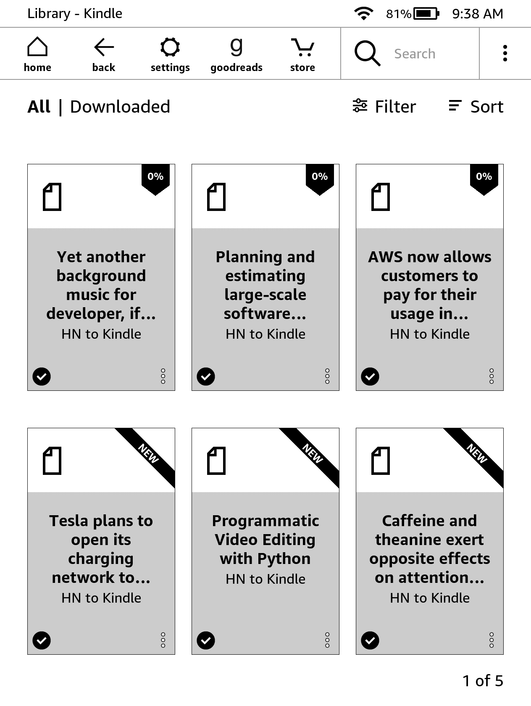

# HN to E-Book

### What?
This program converts the best HN stories to .mobi format to be read using an e-reader.

### Why?
[My Hacker News knowledge assimilation stack](https://abishekmuthian.com/my-hacker-news-knowledge-assimilation-stack/).

#### TL;DR
I read HN on my kindle as I find it useful for reading under sun(while walking in a controlled environment) and taking notes. I was running [hntokindle.com](https://web.archive.org/web/20220216140431/https://hntokindle.com/) to offer this as a service for others.

But Amazon has recently made sending bulk emails to the Kindle impossible by requiring 2FA over registered Amazon email address for each item sent to the Kindle.

Hence I've stripped down HN to Kindle code to enable local transfer to any e-book reader which supports .mobi format and made the project open-source.

### How
1. Retrieve HN stories using official API with a [Go wrapper](https://github.com/hoenn/go-hn/).
2. Filter best(Determined by HN) stories older than 9 hours but lesser than 24 hours with at least 20 comments and top comment older than 2 hours.
3. Convert the HTML to .pdf after applying cosmetic changes using WKhtmlTopdf with a [Go wrapper](https://github.com/SebastiaanKlippert/go-wkhtmltopdf).
4. Convert the .pdf to .mobi using Calibre command line tool.
5. Place the .mobi file on the device.
6. Store the item id in the K,V database to prevent duplicates.

### Requirements
1. [WKhtmlTopdf](https://wkhtmltopdf.org/downloads.html)
2. [Calibre CLI](https://calibre-ebook.com/download)
3. [hntoebook](https://github.com/abishekmuthian/hntoebook/releases)

### Usage

#### Operating System
1. Linux amd64 (Tested)
2. Linux Arm64 (Not tested)
3. darwin amd64 (Not tested)
4. darwin arm64 (Not tested)
5. windows amd64 (Not tested)

#### Set the path to store the .mobi file on the e-book reader
./hntoebook -c 

#### Run hntoebook
./hntoebook

#### Send particular HN story or HN comment to the e-book reader
./hntoebook -i

### Feature parity with HN To Kindle
#### Email
Local file transfer is used instead of Email.

#### Send HN item to Kindle
Individuals HN item (Story or Comment) can be sent to the e-book reader.

#### Filter
Filtering keywords is not implemented as it requires python server for classifier. If there's enough interest for the feature then I will include it in the project.

#### Misc
No web server, Relational database, Concurrency etc. as there's no need for user accounts or subscriptions.

### License

The MIT License

Copyright 2022 ABISHEK MUTHIAN

Permission is hereby granted, free of charge, to any person obtaining a copy of this software and associated documentation files (the "Software"), to deal in the Software without restriction, including without limitation the rights to use, copy, modify, merge, publish, distribute, sublicense, and/or sell copies of the Software, and to permit persons to whom the Software is furnished to do so, subject to the following conditions:

The above copyright notice and this permission notice shall be included in all copies or substantial portions of the Software.

THE SOFTWARE IS PROVIDED "AS IS", WITHOUT WARRANTY OF ANY KIND, EXPRESS OR IMPLIED, INCLUDING BUT NOT LIMITED TO THE WARRANTIES OF MERCHANTABILITY, FITNESS FOR A PARTICULAR PURPOSE AND NONINFRINGEMENT. IN NO EVENT SHALL THE AUTHORS OR COPYRIGHT HOLDERS BE LIABLE FOR ANY CLAIM, DAMAGES OR OTHER LIABILITY, WHETHER IN AN ACTION OF CONTRACT, TORT OR OTHERWISE, ARISING FROM, OUT OF OR IN CONNECTION WITH THE SOFTWARE OR THE USE OR OTHER DEALINGS IN THE SOFTWARE.